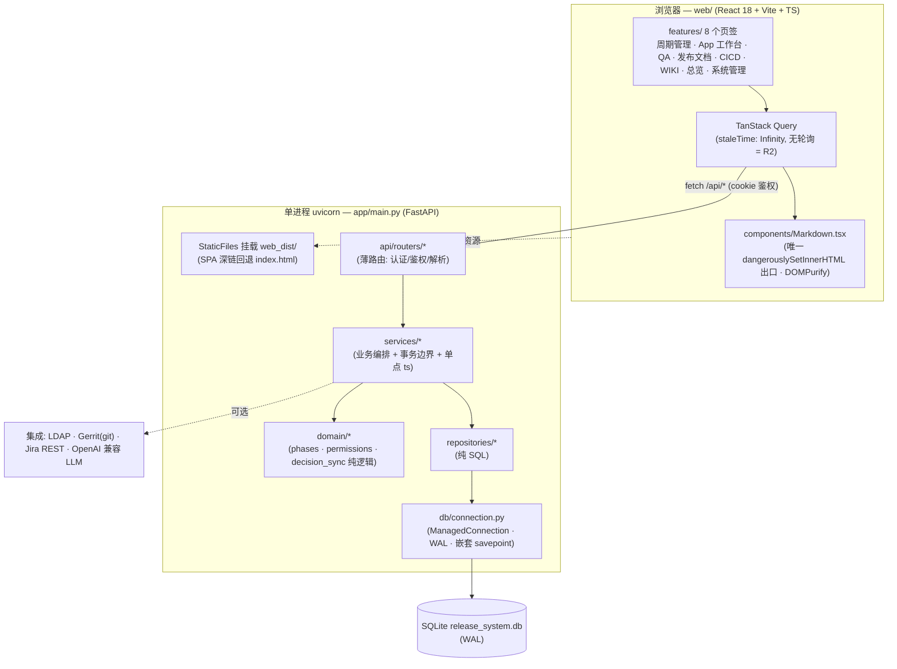
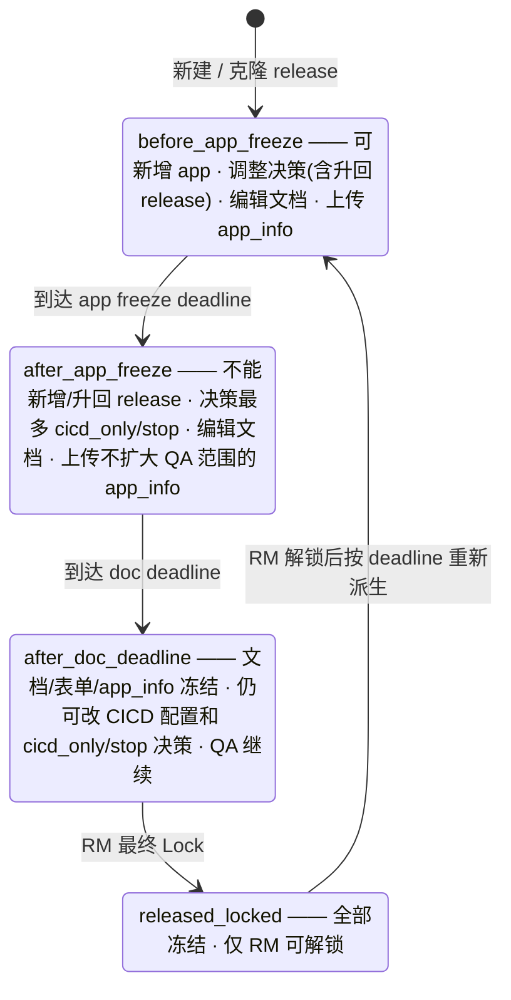
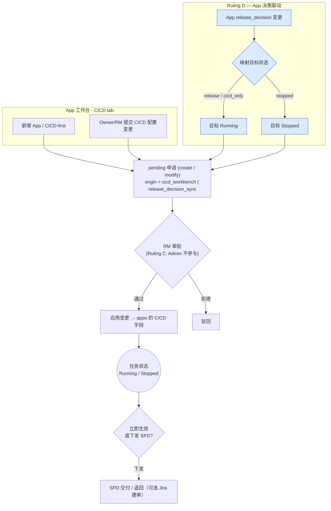

# HPC App 发布信息协作系统

面向 HPC App 发布周期的内部协作工具，把发布范围、Owner 文档、`app_info.json`、QA 结果、Manager Review、最终文档产物和 CICD 交付申请集中到同一个 Web 界面中管理。

本仓库当前是一次 **FastAPI + React/Vite/TypeScript 全量重写**（分支 `rewrite/fastapi-react`），在保持旧系统业务行为的前提下，将原来的单文件 `http.server` + `index.html` 拆分为分层后端（`app/`）与单页前端（`web/`）。当前实现遵循以下约束：

- **刷新策略**：前端去除轮询，数据只在显式刷新 / 进入页面 / 写操作后失效时更新。
- **CICD app-backed**：CICD 由 App 直接承载，App 发布决策驱动 CICD 运行状态（Ruling A/B/C/D）。
- **时区统一**：除历史遗留外，存储与展示的时间均为**北京时间 naive 字符串**（`YYYY-MM-DD HH:MM:SS`，零偏移）。

> 旧版单文件系统（`server.py` + `index.html` + `release_system/core.py`）仍保留在仓库中，**作为冻结的行为参照与 golden 回放基准，不再修改**。

---

## 架构总览



请求路径分层职责：**router**（认证、鉴权、请求体解析，尽量薄）→ **service**（业务编排、拥有事务边界、每个操作取一次北京时间 `ts`）→ **repository**（只写 SQL）→ **ManagedConnection**（WAL、嵌套 savepoint 事务）。纯领域逻辑（阶段派生、权限策略、决策同步）放在 `app/domain/`，不触库。

单进程 `uvicorn app.main:app` 同时提供 `/api/*` 和编译后的 React 应用（`web_dist/`）。`--workers 1` 为**强制要求**：QA AI 分析任务注册表与 LDAP 状态都在进程内。

---

## 技术栈

| 层 | 技术 |
| --- | --- |
| 后端 | Python 3.10+，FastAPI，uvicorn（单进程） |
| 数据库 | SQLite，WAL 模式，`ManagedConnection` 嵌套 savepoint |
| 前端 | React 18 + Vite + TypeScript + TanStack Query + zustand + react-router |
| 认证 | PBKDF2-HMAC-SHA256 本地口令，HttpOnly session cookie；可选 LDAP |
| 集成 | Gerrit `git ls-remote` / `git archive`、Jira REST、OpenAI 兼容 Chat API |
| 测试 | 后端 `pytest`（含 golden 回放）；前端 `vitest` + Playwright e2e；ESLint + tsc strict |

后端依赖见 [requirements.txt](./requirements.txt)。前端依赖见 [web/package.json](./web/package.json)，Markdown 走 `marked` + `DOMPurify`（仅在 `web/src/components/Markdown.tsx` 内）。

---

## 快速开始

### 单进程（生产形态：API + 前端同源）

```bash
# 1) 后端依赖
python3 -m venv .venv && source .venv/bin/activate
python3 -m pip install -r requirements.txt

# 2) 构建前端（产物落在仓库根的 web_dist/）
cd web && npm install && npm run build && cd ..

# 3) 启动单进程，同时服务 API 和 React 应用
python3 -m uvicorn app.main:app --host 127.0.0.1 --port 8000 --workers 1
# 打开 http://127.0.0.1:8000
```

### 开发态（前后端分离 + Vite 代理）

```bash
# 终端 A：后端
python3 -m uvicorn app.main:app --host 127.0.0.1 --port 8000 --workers 1

# 终端 B：前端 dev server（/api 反向代理到 8000）
cd web
NO_PROXY=localhost,127.0.0.1 npm run dev   # http://localhost:5173
```

> **本机代理注意**：本机 `http_proxy`/`https_proxy` 会劫持 localhost。运行 npm / curl 前请设置
> `export no_proxy=localhost,127.0.0.1`（npm 脚本已内置；curl 用 `--noproxy '*'`）。

首次启动会确保默认本地账号存在并创建 `admin`。Admin 初始口令优先级：环境变量 `HPC_ADMIN_PASSWORD` → `admin_password.local` → 自动生成并写入 `admin_password.local`。

默认开发账号（生产环境请立即替换）：

| 用户名 | 口令 | 角色 |
| --- | --- | --- |
| `rm` | `rm` | RM |
| `owner_test` | `owner_test` | Owner |
| `qa` | `qa` | QA |
| `spd_test` | `spd_test` | SPD |
| `guest` | `guest` | Guest |
| `admin` | 见 `admin_password.local` | Admin |

可选集成（LDAP / Jira / QA LLM / Gerrit）的配置文件与环境变量约定与旧系统一致，详见各 `*.example` / `*_demo` 模板。

---

## 角色

- **RM**：管理 release、deadline、Gerrit 信息、测试范围导出、发布文档与 Manager Review CSV、最终锁定/解锁；**唯一的 CICD 申请审批人**，可在 App 工作台的 CICD tab 提交配置变更（Ruling B/C）。
- **Owner**：维护自己负责的 app，提交 release 决策、文档、测试说明、`app_info.json`；可在 App 工作台的 CICD tab 提交 CICD 配置申请。
- **QA**：上传 QA log、标注 QA 状态、使用 AI 分析建议。
- **SPD**：处理被下发的 CICD 交付申请，可标记交付或退回。
- **Admin**：仅负责访问控制——用户/角色管理、清空业务数据、全局删除 app、审计只读；**完全不参与 CICD/release 业务**（Ruling C），看不到 CICD 任务处理页签。
- **Guest**：只读查看发布状态和 QA 信息。

---

## 发布生命周期 / 阶段机

阶段由北京时间 deadline 与 lock 状态实时派生（`app/domain/phases.py`：`derive_phase`）：



> 阶段是**派生值**，不是存储字段：lock 状态优先，其次比较当前北京时间与 doc deadline、app freeze deadline。解锁后阶段会按 deadline 重新计算，因此可能直接落回任意更早阶段。旧的 `release_system_state_machine.svg` 与此图等价但已过时，以本图为准。

### Release 决策

- `release`：进入正式发布、文档生成与 QA。
- `cicd_only`：仅纳入 CICD/infra 管控，不进入正式文档与 QA。
- `stopped`：本轮停止发布或停止维护。

### 决策跨版本同步（§5b）

当 Owner/RM 改一个 app 的 `release_decision` 时，前端会询问是否同步到后续 release；如果变更跨越 CICD Running/Stopped 边界，则必须同步到**所有未锁定 release**（当前 release 除外），避免同一个 CICD task 在不同 release 中出现矛盾运行状态（`app/domain/decision_sync.py`：`resolve_synced_decision`）：

- 目标为 `release`，但后续 release 已过 app freeze 或 doc deadline → 自动降级为 `cicd_only`（绝不向已冻结的 release 增加 QA/测试范围）。
- 其他情况 → 原样套用目标决策。
- 已锁定的 release、不含该 app 的 release：跳过。
- `stopped -> release/cicd_only` 是升运行：当前 release 以及所有被同步的未锁定 release 决策都要等 CICD immediate apply 或 SPD 交付完成后才真正生效；如果审批被拒绝或取消，release snapshot 保持原决策不变。
- `release/cicd_only -> stopped` 是降停止：release 决策立即生效；CICD 审批/交付只是把实际运行状态最终停下来，该同步申请不允许拒绝或取消。
- 任何跨 Running/Stopped 边界的决策变更都会创建 `origin="release_decision_sync"` 的 CICD modify 申请，因此也受 CICD 修改阻塞规则约束；如果同 app 还有未完成的新建申请或带 Jira 的未完成修改申请，则不创建 sync 申请，当前 release snapshot 保持原决策。

### 可发布条件

最终 Release Note / Manual 纳入的 app 必须满足：release 决策为 `release`、Owner 已确认、文档类待补项为空、QA 状态为 `qa_passed` 或 `has_issues`（`has_issues` 不阻塞发布，问题说明合并到已知限制）。

---

## CICD ↔ App 联动

CICD 由 App 直接承载：`cicd_task_requests.app_id` 关联 `apps.id`，`task_id` 存同一个 app id，用于现有 API 字段；系统不再生成 `CICD-xxxx` id。FastAPI 运行路径不读写旧 `cicd_tasks` 表；该表即使存在，也只用于旧 DB / 冻结参考测试可打开。所有写状态的动作都经由「待审批申请」队列，由 **RM** 唯一审批（Ruling B）。App 的发布决策驱动 CICD 运行状态（Ruling D）；CICD 工作台只负责只读信息、近期申请、审批和交付，配置调整统一从 App 工作台的 CICD tab 提交。



要点：

- **B — 无自动通过**：所有提交一律 `pending`，交给 RM；RM 可对自己提交的申请自审（`is_self_approved`）。
- **C — Admin 出局**：Admin 不能提交/审批 CICD，也看不到 CICD 处理页签（仅 RM/SPD 可见）。
- **D — 决策→状态**：决策联动产生一条 `origin="release_decision_sync"` 的 pending modify 申请；前端在申请列表上以「**同步联动**」徽标与普通构建配置申请（`cicd_workbench`）区分。升运行必须等 CICD immediate apply 或 SPD 交付后，所有受影响 release 才一起生效；降停止由 App owner/RM 的 release 决策立即生效，RM 审批不能拒绝或取消。
- **A — 状态锁**：用户的 modify 申请**不允许**直接改 `status`；运行/停止只能由 App 决策驱动。CICD 不再有 `Abandoned` 状态，也不提供废弃/退役/删除入口；退役或删除通过 App 业务流程处理。
- **CICD-first 新建 App**：新建申请待审批/交付期间 app 会保留在 App 工作台；被拒绝或取消后继续保留并显示原因。同一 `(Gerrit URL, branch)` 不能用新名称重复创建；只有使用原 app 名称才能重新提交“新建”CICD 申请。

### CICD 修改阻塞与替换

同一个 app 的 CICD 修改不能越过未完成的上游申请，否则会出现 release 决策已变更但 CICD 实际状态仍停留在旧值的问题。提交 App 工作台 CICD 配置修改、以及任何跨 Running/Stopped 边界的 release 决策同步时，都必须先检查同 app 的未完成 CICD 申请：

- 有未完成的 CICD-first `create` 申请：直接拒绝新的 CICD modify，并提示等待新建申请审批/交付完成后再修改。
- 有未完成的 `modify` 且已绑定 Jira（`jira_id` 非空，交付状态为 `pending` 或 `returned`）：直接拒绝新的 CICD modify；系统不自动取消 Jira，也不调用 Jira API 关闭 issue。正确流程是 SPD 先退回需求，再由 RM 在待交付页拒绝旧申请。
- 只有无 Jira 的 pending `modify`：允许用户确认替换。前端必须明确提示旧申请会被取消，后端收到 `replace_open=true` 后才会取消旧 pending modify 并提交当前新申请。
- `release_decision_sync` 的 Running/Stopped 状态同步申请走同一套阻塞规则；被阻塞时不创建 sync 请求，也不应用新的 release 决策。

### 交付退回后的 RM 拒绝

SPD 退回交付申请后，RM 可以在「CICD 工作台 → 待交付」对 returned 行执行「拒绝」。拒绝必须满足：

- 当前用户是 RM；
- 申请为 `status="approved"` 且 `delivery_status="returned"`；
- 必须填写拒绝理由；
- 拒绝后设置 `status="rejected"`，写入 `reviewer/reviewed_at/review_note`，清空交付待办状态使其不再出现在待交付列表；
- 保留 `jira_id`、`returned_reason`、`returned_at` 作为历史记录；
- 不应用 CICD payload。

对应接口为 `POST /api/cicd/requests/reject-returned`。普通 pending 审批拒绝仍使用 `POST /api/cicd/requests/reject`。

---

## 数据模型：Release Snapshot

`apps` 表只保存全局身份（`id`、`git_url`、`git_branch`、别名、创建信息）。官方名称、类型、官方 URL、描述、文档目标、Owner、release 决策、文档字段、测试说明、`app_info`、QA 状态等都保存在**每个 release 的 snapshot** 中。因此同一个 app 在不同 release 中可以有不同版本、Owner、文档与 QA 状态。新建 release 会从上一版克隆 snapshot 并重置 QA 状态。

CICD↔App 的身份键是 `app_id`。`(git_url, git_branch)` 只用于历史展示 / 兼容匹配，新写入路径必须使用 app id。注意同一个 Gerrit URL 可以有多个 branch，不能只用 URL 匹配。身份解析见 `app/identity.py`（`repo_to_git_identity`）。

---

## 典型流程

1. RM 在「周期管理」导入初始化 CSV，或从上一版克隆新 release，并设置 app freeze / doc deadline。
2. Owner 在「App 工作台」维护本 release 的 app 信息、文档、`app_info.json` 和测试说明，提交 Owner 确认。
3. RM 导出测试范围 CSV；QA 上传 log，必要时用 AI 分析建议，核对后保存 QA 状态。
4. RM 刷新发布文档与 Manager Review CSV。
5. Manager review / Gerrit merge 完成后，RM 执行最终 Lock Release。
6. 需要跟踪构建交付时，Owner/RM 在「App 工作台 → CICD」提交配置申请；RM/SPD 在「CICD 工作台」审批、交付或查看近期申请。

---

## 主要 API（节选）

- 认证：`POST /api/login`、`POST /api/login/ldap`、`POST /api/logout`、`GET /api/me`、`GET /api/ldap/status`
- 状态：`GET /api/state`
- Release：`POST /api/import-initial`、`POST /api/releases/create`、`POST /api/releases/deadlines`、`POST /api/releases/final-lock`、`POST /api/releases/final-unlock`
- App：`POST /api/apps/new`、`POST /api/apps/update`、`POST /api/app-info`、`POST /api/app-info/fetch`
- QA：`POST /api/qa/status-batch`、`POST /api/qa/upload-log`、`POST /api/qa/analyze-log/start`、`GET /api/qa/analyze-log/status`、`GET /api/qa-reports`
- 产物：`POST /api/artifacts/generate`、`POST /api/artifacts/manager-review`、`GET /api/artifacts/<kind>`、`GET /api/test-scope.csv`
- WIKI：`GET /api/wiki/articles`、`POST /api/wiki/articles/save`、`POST /api/wiki/articles/pin`、`POST /api/wiki/articles/delete`、`POST /api/wiki/images/upload`
- CICD：`GET /api/cicd/tasks`、`GET /api/cicd/requests`（含 `origin` 字段）、`GET /api/cicd/deliveries`、`POST /api/cicd/requests/submit`（无 Jira pending modify 替换需 `replace_open=true`）、`POST /api/cicd/requests/approve`、`POST /api/cicd/requests/reject`、`POST /api/cicd/requests/deliver`、`POST /api/cicd/requests/return-delivery`、`POST /api/cicd/requests/reject-returned`
- 管理：`GET /api/admin/users`、`POST /api/admin/users/set-role`、`POST /api/admin/clear-db`、`POST /api/admin/apps/delete`

常见返回码：`401` 未登录，`403` 无权限，`400/500` 业务或服务端错误。

---

## 目录结构

```text
release-system/
├── app/                         # FastAPI 后端（新）
│   ├── main.py                  # create_app：装配 router + lifespan + StaticFiles(SPA)
│   ├── api/routers/             # 薄路由（auth/apps/qa/artifacts/cicd/wiki/admin/...）
│   ├── services/                # 业务编排 + 事务边界（含 cicd_service / wiki_service）
│   ├── repositories/            # 纯 SQL
│   ├── domain/                  # phases · permissions · decision_sync 等纯逻辑
│   ├── db/connection.py         # ManagedConnection（WAL，嵌套 savepoint）
│   ├── identity.py              # repo→git 身份解析（CICD↔App 统一键）
│   └── timeutil.py              # beijing_timestamp()
├── web/                         # React/Vite/TS 前端（新）
│   ├── src/{api,types,lib,store,components,features,routes}/
│   └── README-web.md            # 前端开发说明
├── tools/                       # 辅助工具（如身份解析）
├── tests/                       # pytest（含 tests/golden/ 回放）
├── release_system/              # 旧系统（冻结，golden 基准，勿改）
│   ├── core.py
│   └── wiki/core.py
├── server.py                    # 旧单文件服务（冻结，勿改）
├── index.html                   # 旧单页前端（冻结，勿改）
└── release_system_state_machine.svg  # 旧状态机图（已被上文 mermaid 取代）
```

运行时生成且已被 `.gitignore` 忽略：`release_system.db*`、`web/node_modules/`、`web_dist/`、`qa_logs/`、`admin_password.local`、`ldap.conf`/`jira.conf`/`qa_llm.env` 等。

---

## 测试

```bash
# 后端：全量（从仓库根运行）
python3 -m pytest -q
# golden 回放（Phase-2 parity）单独跑
python3 -m pytest tests/golden/test_golden_replay.py -q

# 前端（在 web/ 下）
npm run build          # tsc strict + vite
npm run lint           # eslint --max-warnings 0
npx vitest run         # 单元测试
npm run test:e2e       # Playwright e2e
```

> golden 文件位于 `tests/golden/responses/`，由 `tests/golden/capture.py` 基于**冻结的旧 core** 采集；时间戳被擦洗为 `SCRUBBED_TIMESTAMP`。行为不变的改动应保持 golden 不变；有意行为变更需把受影响 golden **重新基线为新的、已核对正确的响应体**，绝不删除或跳过来掩盖回归。

---

## 开发约定

- 业务写操作用 service 层的事务边界（`ManagedConnection.transaction()` / 嵌套 savepoint）包住，成功统一提交、异常统一回滚。
- 时间统一用 `app.timeutil.beijing_timestamp()`，存与显示都是北京时间 naive 字符串，无 `+8` 计算、无 UTC 偏移。
- 前端遵守 R2：无后台轮询（仅 QA AI 任务 1s 轮询，卸载/切版本即取消）；Markdown 只经 `Markdown.tsx` 渲染。
- 旧系统三件套 `server.py` / `release_system/` / `index.html` 冻结，所有新行为写在 `app/` + `web/` + `tools/`。
- 仓库内已有开发规范 skill：`.agents/skills/release-system-dev/`。
</content>
