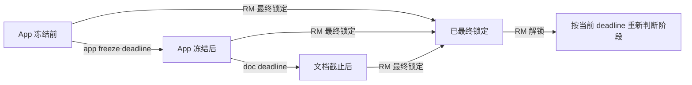

# HPC App 发布信息协作系统

用于管理 HPC / AI4Sci App 的发布范围、Owner 文档、Gerrit app_info、QA 结果、CICD 申请与交付，以及发布文档产物。当前运行入口是 `app/main.py`（FastAPI）和 `web/src/main.tsx`（React）。

本文说明当前实现，规则以代码为准。需求建议见 [发布流程改进建议](docs/release-process-roadmap.md)，其中的拟建功能不代表已经上线。项目数据库可能是真实业务库，开发、测试和文档导出应使用下面说明的隔离方式。

## 从哪里开始

| 使用者 | 日常入口与职责 |
| --- | --- |
| RM | 周期管理：初始化或克隆周期、设置 deadline、最终锁定；App 工作台：维护范围与信息；CICD：审批、交付处理；发布文档：导出和检查 |
| Owner | App 工作台：维护本人负责的 App、文档与测试说明，确认信息，提交新增或 CICD 配置申请 |
| QA | QA：查看测试范围与命令、批量标注结果、上传日志、使用 AI 分析建议 |
| SPD | CICD：查看交付任务、确认交付或退回；Jenkins 失败查询和 CICD 助手辅助排查 |
| Guest | 查看总览、App 和 QA 等矩阵允许的页面；不编辑业务数据 |
| Admin | 系统管理：角色维护、数据库清理、全局 App 删除；前端只进入 `/admin`，不承担 RM 审批职责 |

这是职责摘要，不是权限实现。角色、页签与命名能力以 [access_control.json](shared/access_control.json) 为准；所有权、阶段、锁定与申请状态还会进一步限制操作。后端鉴权是最终边界，前端按钮仅用于展示。

现有页面还包括开发 WIKI、Jenkins 失败查询、CICD 助手及其 V2 界面、JIRA agent。完整导航见 [routeConfig.ts](web/src/routes/routeConfig.ts)。

## 发布周期怎么运行

1. 首次使用由 RM 导入 CSV。`import_initial_rows()` 只允许在尚无 release 时初始化；同一仓库与分支的行合并为一个 App，没有仓库或分支的行跳过。
2. 后续周期由 RM 从最近一个 release 克隆。代码继承已有快照和 Owner 确认状态，重置 QA 状态、QA 备注、缺失项缓存及快照锁定标记；不会自动要求每个 Owner 重新确认。
3. Owner / RM 在 App 工作台维护发布决策、说明与配置。新增 App 走 CICD-first 流程，没有直接 `/api/apps/new` 创建接口。
4. 从 Gerrit 获取或上传 app_info，记录来源、commit 和同步时间，派生版本、芯片及测试说明。实际内容变化可能使 Owner 确认失效；重复拉取相同内容不会仅因拉取动作而取消确认。
5. QA 使用范围表、命令表和日志记录结果。AI 分析返回建议，最终状态仍由 QA / RM 保存；分析成功不等于自动批准发布。
6. RM 检查范围、缺项、QA、待处理 CICD 申请与产物，再最终锁定。需要修改时可以解锁，解锁会删除最终产物；目前没有独立的签字审批或不可覆盖的发布包版本库。

阶段由 [phases.py](app/domain/phases.py) 根据锁定标记和 deadline 计算，并非人工填写状态。


```mermaid
flowchart LR
    A[App 冻结前] -->|app freeze deadline| B[App 冻结后]
    B -->|doc deadline| C[文档截止后]
    A -->|RM 最终锁定| D[已最终锁定]
    B -->|RM 最终锁定| D
    C -->|RM 最终锁定| D
    D -->|RM 解锁| E[按当前 deadline 重新判断阶段]
```

- 冻结前可以新增发布范围。冻结后不能升级为 `release`，已在发布范围内的 app_info 更新也不能扩大受控 QA 范围。
- 文档截止前仍可维护文档、app_info 和 Owner 确认；截止后保留的操作包括符合规则的决策调整、CICD 配置、Gerrit 身份、QA 状态与日志。
- 最终锁定阶段的领域操作表为空。各接口是否完整执行该表仍需结合调用链核查，不能把规则定义当成并发安全保证。
- 空 deadline 表示尚未设置截止时间。日期输入提交 `YYYY-MM-DD`，后端 deadline 归一化为该日 `23:59`。

## 三个概念必须区分

| 概念 | 当前实现 |
| --- | --- |
| 发布决策 | `release`：计划进入发布/文档/QA；`cicd_only`：仅 CICD；`stopped`：停止维护/发布。后两者不进入当前生成的发布文档 |
| 文档收录资格 | `qualifies_for_docs()`：决策为 release、Owner 已确认、无文档类缺项。**QA 状态不是文档收录门槛** |
| QA 发布资格 | `qualifies_for_final()`：文档条件成立，且 QA 为 `qa_passed` 或 `has_issues`。Manager Review 使用此资格；`has_issues` 可以通过此门槛，不代表问题已关闭 |

规则见 [gates.py](app/domain/gates.py)、[qa.py](app/domain/qa.py) 和 [domain_metadata.json](shared/domain_metadata.json)。社区字段要求还由 [app_service.py](app/services/app_service.py) 的 `_missing_items_for()` 补充。

**最终锁定不是“全部 App 已通过 QA”的审批证明。** 当前锁定生成逻辑采用文档收录条件，缺项 App 可被排除在生成文档之外；它会检查特定未完成的 CICD 决策同步，但没有完整的发布签核流程。对外发布前应显式核对完整计划范围和实际收录范围。

## CICD 与 App 的关系

- `apps.id` 是当前业务身份。`cicd_task_requests.app_id` 关联 App，兼容字段 `task_id` 也保存同一 App ID。`cicd_tasks` 是遗留兼容表，不是当前任务事实源。
- CICD 状态由 App / release 快照和未完成请求派生；`release`、`cicd_only` 对应 Running，`stopped` 对应 Stopped。普通配置申请不允许直接修改 `status`。
- 新增和配置变更均先进入 pending，再由 RM 审批。RM 可以审批自己的申请，记录 `is_self_approved`。
- 审批可立即应用，也可派发 SPD，等交付确认再应用。SPD 可以退回；RM 可以重新派发、按规则应用退回申请，或填写原因后拒绝退回申请。
- CICD 工作台的任务配置是只读的，申请审批与交付操作仍在该页；配置编辑入口在 App 工作台的 CICD tab。
- Running / Stopped 边界变化会联动所有符合条件的未锁定周期，不能只考虑后续周期。启动升级、停止降级、拒绝回滚和冻结跨越的细节见 [业务流程开发约束](.agents/skills/release-system-dev/references/workflows.md)。
- 不提供 CICD Abandoned / 删除生命周期。全局 App 删除归 Admin 管理，代码会检查锁定周期引用。

实现入口：[cicd_service.py](app/services/cicd_service.py)、[decision_sync.py](app/domain/decision_sync.py)、[identity.py](app/identity.py)。仓库身份匹配必须同时考虑仓库与分支；manifest XML 的存储路径与解析后的 Git 身份不能混为一谈。

## JIRA agent（数字员工）

JIRA agent 是按组配置的数字员工，第一阶段处理 HPC 组的 Bug 类工单：收集信息、分类、判断归属、复现、分析，属于本组且能修复时完成修复与验证。部署、配置和迁移步骤见 [JIRA agent 部署与使用](docs/jira-agent.md)，开发约束见 [jira-agent-dev 技能](.agents/skills/jira-agent-dev/SKILL.md)。

| 位置 | 职责 |
| --- | --- |
| 服务器 A（本网站） | 对话、消息、文件、排队、执行记录、JIRA 评论；通过 WebSocket + token 连接 B |
| 服务器 B（组的 `codex app-server`） | agent 本体；本组知识包（AGENTS.md、skills）、Codex 登录凭证、访问 C/D/E 的 SSH 凭证。B 上不部署适配服务 |
| 服务器 C/D/E | 复现、构建、测试环境，由 B 上的执行用户登录。交单时选择：agent 从 RM 维护的系统机器列表中自选，或用户自填 `user@host`（先经网页终端从 B 上传公钥并测试免密登录） |

使用规则：

- 只有当前 JIRA assignee 或 RM 可以把工单交给 agent 或与 agent 对话，每次写操作都实时核对 JIRA。页签可见角色以 `access_control.json` 的 `jira-agent` 为准。
- 找单：留空显示自己名下未关闭的工单，RM 显示本组 JIRA 用户组（`JIRA_MEMBERS_GROUP`）成员的未关闭工单；输入一个 JIRA 编号只显示这张工单（一次只能输入一个）；其他输入按 JQL 查询。RM 还可以切到“agent 处理过”，查看所有交给过 agent 的工单，包括 JIRA 已关闭的。
- agent **只在 JIRA 追加评论**（结论、证据、补丁、下一步建议），不改 assignee、状态或代码。assignee 读评论后决定 resolve、转交，或在网站补充信息让 agent 继续。
- 一个对话对应一个 Codex thread 和 B 上一个工作目录，归属于交单时的 assignee。assignee 变更后旧对话只读，新 assignee 交单时新建对话；转回原 assignee 也不复用。同一 assignee 可以主动新建对话。
- 网站侧持久排队，每组同时运行的轮次不超过 `MAX_CONCURRENT`；运行中的补充信息直接发给 agent，排队中的消息合并到这一轮。机器资源（如 GPU）由 B 上知识包约定的 `flock` 锁控制。
- 网站重启不丢轮次：Codex 的轮次不依赖网站连接，重启后网站重新连接 B，本轮仍在运行则继续接管，已结束则照常收尾并发评论，尚未开始则重新排队。只有 B 也重启过或连不上 B 时才标记为已中断，发送消息可继续。详见 [docs/jira-agent.md](docs/jira-agent.md)。

实现入口：[jira_agent_service.py](app/services/jira_agent_service.py)（交单与对话规则）、[jira_agent_runner.py](app/services/jira_agent_runner.py)（排队与执行）、[codex_app_server.py](app/integrations/codex_app_server.py)（通用 Codex 协议客户端）、[jira_agent.py](app/domain/jira_agent.py)（结论 schema、提示词、评论格式）、[JiraAgentPage.tsx](web/src/features/jiraAgent/JiraAgentPage.tsx)，B 侧知识包与启动脚本在 [deploy/jira-agent/](deploy/jira-agent/)。

后续阶段（尚未实现）：跟踪最终 root cause 与人工纠正的学习闭环、按 component 路由到其他组的数字员工、适配类与优化类任务。

## 数据与文档产物

| 数据 | 存储与边界 |
| --- | --- |
| App | `apps`：全局仓库身份、别名和 CICD 配置 |
| 周期快照 | `snapshots`：以 `(release_id, app_id)` 为键，业务字段存于 `data_json` |
| 发布周期、时间线 | `releases` 与 `release_schedule` 是两张独立表；当前没有周期外键将时间线条目和 release 强制绑定 |
| 申请和交付 | `cicd_task_requests`；申请记录与 App 关联，部分跨周期信息存于 payload |
| QA 日志 | `qa_logs.content` 为 BLOB，每个 release 当前只保留一份，重新上传覆盖；旧 `storage_path` 用于兼容迁移 |
| 发布产物 | `artifacts` 以 `(release_id, kind)` 为键；同类草稿重新生成会覆盖，不是历史版本库 |
| 用户、会话、审计 | `users`、`sessions`、`audit`；这些数据不应整体导出到文档或测试夹具 |
| WIKI | `wiki_articles`、`wiki_images`，图片存于数据库 |
| CICD 助手会话 | 独立 SQLite 库，由 `ASSISTANT_DATABASE_URL` 指定；不写入主业务库 |
| JIRA agent | 独立 SQLite 库 `JIRA_AGENT_DATABASE_URL`（对话、轮次、时间线、文件索引）；上传文件与拉回的产物在 `JIRA_AGENT_DATA_DIR`；Codex thread 与工作目录在服务器 B |

常规生成的四类产物为 `release_note`、`manual`、`ai4sci`、`data`。Manager Review CSV 单独生成；测试范围 CSV 按需导出，不是 artifacts 的一个 kind。最终锁定生成上述四类 final 产物，不会自动把 Manager Review 升格为最终审批记录。

生成文档是一个时间点的结果，不能假定后续编辑已同步到旧草稿。Gerrit plan 接口只返回计划与命令，**不执行 Git push**。C500/X201 RST 合并使用 [文档整合技能](.agents/skills/c500-manual-integrator/SKILL.md)，指定目标 release 后再导出，避免误取另一个周期的 final 产物。

## 代码结构与事实源

```text
app/api/routers/       HTTP、依赖和权限入口
app/services/          业务编排与事务；部分历史 SQL 尚未下沉
app/domain/            阶段、决策、门槛、权限与解析规则
app/repositories/      数据访问
app/db/                主库与助手库连接、建表和兼容处理
app/integrations/      LDAP / Gerrit / Jira / LLM / Codex app-server 集成
web/src/               React 页面、HTTP 客户端、查询缓存和 UI 状态
shared/                跨前后端权限、词表和集成默认配置
deploy/jira-agent/     JIRA agent 服务器 B 的启动脚本与 HPC 知识包
.agents/skills/        开发、JIRA agent 开发与 C500/X201 文档工作流（.claude/skills 为指向它的软链接）
```

- 权限：`shared/access_control.json` → Python `domain/permissions.py` / React `lib/accessControl.ts`。
- 稳定词表和字段描述：`shared/domain_metadata.json` → 后端 `domain/shared_metadata.py` 及前端对应 lib。
- 集成默认值：`shared/integrations.json` → `app/config.py`；浏览器只取得它所需的非敏感配置。
- 时间：新写入使用 `app/timeutil.py` 的北京时间无时区字符串；deadline 精度为分钟，业务事件通常精确到秒，时间线为日期。**旧库仍可能有 UTC ISO 数据，不可假定迁移已完成，也不能对全部值统一加 8 小时。**
- Markdown：页面中的 HTML 注入集中在 `web/src/components/Markdown.tsx` 的 DOMPurify 流程。
- 刷新：全局查询默认永久新鲜、关闭自动重取；页面显式刷新或写后失效，QA AI 任务与 JIRA agent 运行中的对话例外按秒轮询。进入页面并不保证重取已缓存数据。

`server.py`、`index.html`、`release_system/` 保留为旧实现与测试兼容参考，日常功能开发不修改这些文件。它们的旧行为、注释和 historical golden 都不能推翻当前明确的业务实现。

## 安装和本地开发

后端按 `pyproject.toml` 要求使用 Python 3.11+；前端需能安装 `web/package-lock.json` 中依赖的 Node/npm 环境。后端依赖暂未完整锁定版本，安装可重复性仍有改进空间。

```bash
python3 -m venv .venv
source .venv/bin/activate
python -m pip install -r requirements.txt -r requirements-dev.txt
cd web
npm ci
cd ..
```

开发实例使用独立数据库，不让默认路径落到真实 `release_system.db`。下面启动一个空的本地实例，后续在界面导入测试数据：

```bash
export NO_PROXY=localhost,127.0.0.1
export no_proxy=localhost,127.0.0.1
export DB_PATH=/tmp/release-system-dev.db
export ADMIN_PASSWORD_FILE=/tmp/release-system-dev-admin.local
export ASSISTANT_DATABASE_URL=sqlite:////tmp/release-system-dev-assistant.db
python -m uvicorn app.main:app --host 127.0.0.1 --port 8000 --workers 1
```

另一个终端从 `web/` 运行 `npm run dev`，默认 Vite 端口为 5173，`/api` 代理到 8000。也可通过进程环境变量 `API_TARGET` 指定其他开发后端。浏览器开发详情见 [前端说明](web/README-web.md)。

首次初始化会创建 `app/domain/authn.py` 中的固定开发账号，目前没有仅开发环境启用的开关。Admin 不存在时使用 `HPC_ADMIN_PASSWORD`、`ADMIN_PASSWORD_FILE` 指定文件，或生成随机口令。部署前应处理开发账号，不要把该初始化机制当作生产账号管理方案。当前会话也没有服务端过期策略。

生产形态由单个进程服务 API 和已构建的前端：在 `web/` 运行 `npm run build`，产物进入 `web_dist/`，再从仓库根启动 uvicorn。实际部署明确配置业务库路径；**保持单 worker**，QA 任务状态目前存于进程内存。构建、启动服务或连接生产实例都不是纯只读操作。

## 集成配置

`app/config.py` 使用环境变量和根目录 `.env`，环境变量优先；具体字段、默认值以代码为准。不要把真实配置文件内容粘贴进 README。

| 配置入口 | 作用 |
| --- | --- |
| `DB_PATH` / `ADMIN_PASSWORD_FILE` | 主业务库与 Admin 初始口令文件 |
| `LDAP_CONF_PATH` / `JIRA_CONF_PATH` / `QA_LLM_ENV_FILE` | 对应集成配置文件路径；实际键由各加载器读取 |
| `GERRIT_SSH_BASE_URL` | 覆盖共享的 Gerrit SSH origin；前端格式化也使用它时需重新构建 |
| `GERRIT_FETCH_MAX_WORKERS` | 批量 Gerrit 拉取并发，默认 4，运行时限制为 1–16 |
| `CICD_AGENT_BASE_URL` / `CICD_AGENT_TIMEOUT_SECONDS` | Jenkins/CICD 助手服务地址与超时，浏览器经过同源后端代理 |
| `ASSISTANT_DATABASE_URL` | 助手会话库；当前仅支持 `sqlite:///` URL |
| `ASSISTANT_HISTORY_LIMIT` / `ASSISTANT_SUMMARY_*` | 助手上下文窗口及滚动摘要配置 |
| `HPC_DOCS_GERRIT_REMOTE` / `HPC_RELEASE_DATA_GERRIT_REMOTE` | 生成 Gerrit 提交计划的目标；不会自动发布 |
| `JIRA_AGENT_CONF_PATH` | 各组数字员工配置（B 的地址、token、工作目录根、并发与限时），模板为 `jira_agent.conf.example` |
| `JIRA_AGENT_DATABASE_URL` / `JIRA_AGENT_DATA_DIR` | JIRA agent 独立库与文件目录 |
| `JIRA_AGENT_RUNNER_ENABLED` / `JIRA_AGENT_PUBLIC_BASE_URL` | 是否在进程内运行队列；JIRA 评论中网站链接的对外地址 |

## 只读检查、备份与验证

检查真实库时用 SQLite URI `mode=ro` 和 `PRAGMA query_only=ON`，不要使用 `app.db.connection.connect()`：后者会建表、补默认账号并运行兼容迁移。`GET /api/state` 也可能回写缺失项，因此不能用于严格只读审计。

```python
import sqlite3
from pathlib import Path

uri = Path("release_system.db").resolve().as_uri() + "?mode=ro"
with sqlite3.connect(uri, uri=True) as conn:
    conn.execute("PRAGMA query_only=ON")
    print(conn.execute("SELECT COUNT(*) FROM apps").fetchone()[0])
```

在线备份使用 SQLite backup API 或 `sqlite3 ... .backup`，不要直接复制活跃 WAL 数据库的主文件。主库和助手库分别备份；备份包含敏感数据，不提交 Git。恢复、迁移和清理先在副本验证，明确要替换的库与服务后再执行。

测试入口：后端 `python -m pytest -q`；前端 `npm run build`、`npm run lint`、`npm test`、`npm run test:e2e`。具体隔离参数、Playwright 的 5176 端口和 golden 注意事项见 [验证说明](.agents/skills/release-system-dev/references/verification.md) 与 [golden 说明](tests/golden/README.md)。测试数量和本机某次通过记录不作为固定规范。

## 文档维护

README 负责产品、使用入口和运行方式；技能负责开发/文档整合时的执行约束；`references/` 保存按需读取的业务和验证细节。真实数据分析与功能建议单独放在 `docs/`，不把一时的业务数量、历史任务分工、特定模型名或机器路径记忆变成永久开发要求。

已退休的阶段 briefs 和 `.agents/projects/` 记忆不作为运行依赖。它们的有效约束已迁入当前技能；历史上下文可从 Git 历史查看。
