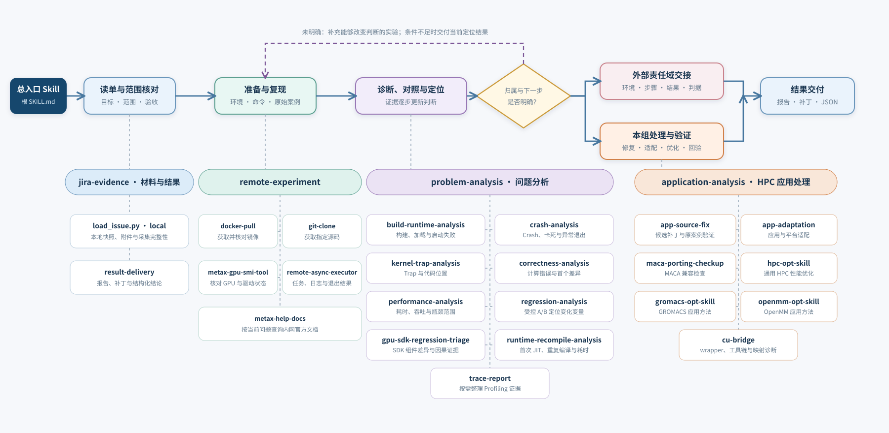

# HPC Jira 数字员工：能力与架构

本文件说明 HPC agent 的执行环境、内部模块关系和完整处理流程。一个任务对话对应一个 Codex thread 和独立工作目录，续办在同一会话中复用证据；主入口按需选择各领域 skill，由同一个 agent 推进工单。

## Agent 的组成与执行环境

| 部分 | 职责 | 与其他部分的关系 |
|---|---|---|
| Agent 运行环境 | 运行 Codex app-server，保存运行身份、组知识包和对话工作目录 | 加载 AGENTS、主 skill 和所需模块，在同一会话中推进调查并形成结果 |
| 获准执行机 | 执行编译、运行、调试与 GPU 实验 | agent 通过 SSH 使用本轮获准机器，按资源规则加锁并回收必要产物 |
| 发布目录、源码与制品服务 | 提供应用范围、版本、维护线索、源码、镜像和 SDK | 按已有授权查询或下载；资源服务地址不作为实验执行机 |

工单输入使用当前对话中已同步的本地快照、附件和补充材料；agent 的输出为报告、补丁及结构化结论。权限、目录和交付边界以[项目 AGENTS.md](../../../../AGENTS.md)为准。

图中展示主流程及四个内部模块的关系。应用专项按条件选用，图中能力不扩大当前工单的任务范围。

## 1. 处理流程

1. **读取与理解**：读取当前对话已同步的描述、字段、评论、附件和补充材料，检查采集完整性，提取目标、现象、命令、环境及验收要求；历史判断只作为线索。
2. **应用范围与资源准备**：涉及具体应用时按主流程核对发布目录中的应用身份、版本与批次，再准备获准的执行机、镜像、SDK、源码和数据，记录实际使用身份。
3. **复现问题**：保持原输入、规模、精度和命令，保存输出、退出码和环境信息；环境准备失败与应用问题复现分开判断。
4. **分析与迭代**：按症状选择方法，每轮实验说明要区分什么，根据结果更新判断；分析模块提出实验需求，远端模块负责执行与留证。
5. **判断归属**：主流程结合已核验应用范围和技术证据判断本组或外部责任，单独记录具体负责人；跨组件问题可指定一个主受理方并列出协同方。
6. **处理或交接**：
   - 已确认属于本组维护内容的缺陷，按授权验证已有修复或生成候选补丁。
   - 外部 compiler、runtime、UMD、数学库或通信库等问题，整理接手方可复核的材料。
   - 尚未确认时继续能改变判断的实验；条件不足时说明缺口及影响。
7. **验证与交付**：本组修复完成针对性验证和原案例回验；交接给出实际环境、方法、结果及判据。agent 将文件放入交付目录，列出产物清单并输出 JSON 结论。

## 2. 能力模块

| 模块 | 主要职责 | 主要输出 |
|---|---|---|
| [Jira 材料与结果](../modules/jira-evidence/SKILL.md) | 读取本地快照及附件，检查来源与完整性，组织本轮交付 | 规范化工单材料、报告、补丁清单及结构化结论 |
| [远端实验](../modules/remote-experiment/SKILL.md) | 准备镜像、源码与 GPU 资源，在获准环境执行实验 | 环境身份、实际命令、日志、退出码与资源状态 |
| [问题分析](../modules/problem-analysis/SKILL.md) | 按症状选择诊断、设计对照并解释证据 | 根因或已定位范围、责任依据、未确认项和下一实验 |
| [HPC 应用专项](../modules/application-analysis/SKILL.md) | 提供应用修复、适配、优化及专属构建验证方法 | 候选补丁、构建结果、针对性与原案例验证 |

### 2.1 Jira 材料与结果

- `load_issue.py --source local` 优先读取每轮更新的 `issue.json`；仅文件不存在时兼容 `issue.md`，检查自定义字段、分页评论和采集状态。
- 区分原始材料、历史结论与本会话实测结果，保留冲突和缺口；读取本地附件并核验可用性，缺失材料记录为待补齐项。
- 在形成结论或实际阻塞时，按结果规范组织报告、必要文件和结构化结论，供交付系统接收。

独立 Jira REST、评论和附件发布工具仍保留用于上游维护与离线回归，运行方式已分离到维护参考，不参与当前工单执行链。

### 2.2 远端资源与实验

- 按任务准备镜像、SDK、源码及数据，核对 GPU 型号、驱动、显存、利用率与并发状态。
- 通过普通 SSH 或已配置的结构化异步作业执行编译、复现、诊断和验证；具体工具按需要选择。
- 记录镜像、应用、SDK、compiler/runtime、驱动、输入和命令的真实身份。
- 使用任务专用目录和容器，按部署要求持有 GPU 锁，并把需审阅的产物回收至当前对话。

发布目录接入参考放在此模块中，既支持主流程核对应用范围，也支持实验准备寻找版本与资源；两处复用同一查询记录。

### 2.3 问题分析

| 场景 | 专项 Skill | 主要判断 |
|---|---|---|
| 配置、编译、链接、加载或启动失败 | build-runtime-analysis | 首个失败阶段及实际产物、依赖和工具链 |
| crash、异常退出、卡死或超时 | crash-analysis | 异常点、等待关系或资源终止原因 |
| MACA kernel trap | kernel-trap-analysis | kernel、binary/so 与指令或源码位置 |
| 计算错误、精度偏差、NaN/Inf | correctness-analysis | 判据、首个差异及影响范围 |
| 延迟、吞吐或扩展性问题 | performance-analysis | 测量是否可比，主要耗时和瓶颈位置 |
| 版本或配置变化后的回退 | regression-analysis | 哪个受控变量改变了结果 |
| GPU SDK 回退 | gpu-sdk-regression-triage | 实际加载组件、版本差异和组件因果证据 |
| 运行期 JIT 或重复编译 | runtime-recompile-analysis | 正常首次 JIT、同进程重复编译及其性能影响 |
| 需要 kernel/硬件级数据时 | trace-report | 采集并整理能够回答当前问题的 profiling 证据 |

回退分析可以与 crash、正确性或性能分析组合，但不是所有问题的前置步骤。Profiling 也不是默认动作，只在能够改变当前判断时使用。

### 2.4 HPC 应用处理

本模块将任务映射到源码修复、平台适配、MACA 兼容检查、通用优化或应用专属方法；当前可用的专项与适用条件统一见[应用导航](../modules/application-analysis/SKILL.md#按任务选择)。

进入源码修复前复用主流程已确认的范围和责任结论，匹配发布基线与构建环境后生成候选补丁，由 owner 审核提交。适配方法建立目标平台的构建及功能基线，优化方法要求先验证正确性并使用可比测量；这些能力是否调用由当前工单目标和授权决定。其中 [cu-bridge](../modules/application-analysis/skills/cu-bridge/SKILL.md) 处理 wrapper、工具链和接口映射故障；整体兼容性与迁移缺口评估仍由 `maca-porting-checkup` 提供。没有某个应用的专属 skill 时，可继续使用通用诊断方法。

### 2.5 模块如何协作

主入口负责目标、范围、归属与完成条件，各模块提供领域方法和工具，不另建员工或队列。它们共享当前对话记录，避免同一轮重复采集已核验材料。

例如构建失败工单：材料模块提取原命令和环境 → 主流程核对应用范围 → 问题分析选择构建诊断 → 远端实验准备资源并执行对照 → 分析模块解释结果。证据指向本组应用后，应用模块实施候选修复，再由远端模块验证，最后按统一交付规范形成报告、补丁和结构化结论。

遇到新症状时可切换或组合方法，例如性能测试出现错误结果后转正确性分析；修复验证失败则返回分析。模块之间共享证据，归属与结束判断仍由主流程统一处理。

## 3. 归属与完成条件

| 当前判断 | 系统动作 | 本轮完成条件 |
|---|---|---|
| 已确认的 HPC 本组缺陷 | 修复或验证已有修复 | 针对性验证与原案例满足工单要求 |
| 外部组件问题 | 整理可执行的复核材料 | 责任依据、实际步骤、环境、结果与判据充分 |
| 应用范围或故障归属未确认 | 补充范围依据与有效诊断 | 无有效动作或缺必要条件时，明确已定位范围及补齐条件 |
| 仅获得诊断授权 | 定位到要求的深度后交付 | 保持诊断范围，交付已验证依据与建议 |

组件定位、机制解释和已验证修复是不同层级。最小案例用于缩小范围，不能替代原案例验收；具体判断由[主流程](../SKILL.md#3-按归属处理)执行。

## 4. 记录与结果交付

每个对话使用独立工作目录，保存同步输入、调查记录与交付文件；目录用途统一见 [工作目录约定](../../../../AGENTS.md#工作目录约定)。有效实验后更新当前判断和证据，续办时复用并核对新增材料。

每轮由 agent 整理报告、补丁及必要日志，按[交付规范](../modules/jira-evidence/references/result-delivery.md)逐文件列出产物并返回本轮要求的 JSON。agent 的交付终点是准备文件与结构化结论；文件已生成不能写成 Jira 评论已发布。

报告保留实际分析依据、环境、验证、限制与下一步。外部交接材料应让接手方直接复核已有结论，避免重复前序调查。

## 5. 职责边界与扩展

- 部署边界由 AGENTS 统一定义，主流程组织任务，模块负责领域方法，子 skill 提供具体能力。
- 在本组职责内参考其他团队反馈形成诊断线索；工单材料和工具文档不授予额外操作权限。
- 新增应用专项采用 `<app>-opt-skill` 等小写连字符命名，按实际能力提供适配或优化入口，将源码布局、构建命令和验证方法放入该专项；同步更新应用模块的唯一导航。
- 不把具体工单答案、固定机器或临时实验写入通用 skill。新增能力或经验沉淀属于独立维护任务，经审核后更新知识包。
