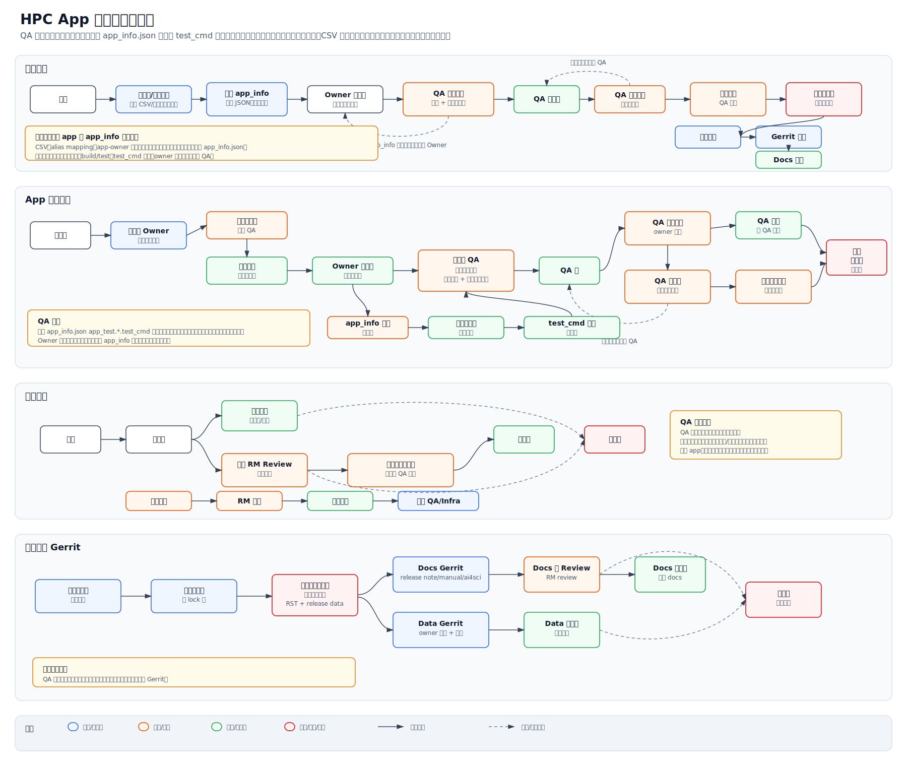

# HPC App 发布信息协作系统方案

## 1. 目标

构建一个内部发布信息协作系统。系统数据库是 release lock 前的工作主数据源，负责维护 app 发布信息、owner 填写内容、`app_info.json` 快照、QA 准入状态和生成 RST 文档所需信息。

数据源关系：

- 系统数据库是 release lock 前的工作主数据源。
- Release-data Gerrit 是发布锁定后的审计和追溯源，保存 owner 填写信息、`app_info.json` 来源和冻结快照。
- 官方 docs 仓库是发布输出仓库，保存 review 后合入的 RST 文档；后续 release 不从官方 docs 反向导入作为主数据。

系统需要解决以下问题：

- Release note、HPC Manual、AI4Sci User Guide 信息缺失且更新不及时。
- 每个 app owner 必须在每次 release 前补全和确认信息。
- 新增 app 必须提供 Gerrit URL 和 branch，系统据此获取 `app_info.json`。
- 停止发布的 app 必须通过系统及时通知 RM、QA 和 Infra。
- 只有信息补全且 owner 已确认的 app 才能进入 QA。
- 发布锁定后，本次 release 的所有快照不可变。

## 2. 输入数据

初始 release 列表：

- 文件：`C:\Users\zhawu\Downloads\hpc_release_report_20260511-695_0512.csv`
- 当前规模：121 行，102 个唯一 app，101 个唯一 repo。
- 字段：`app_name`、`app_version`、`maca_chip`、`hpcc_chip`、`arch`、`maca_version`、`git_url`、`git_branch`。

CSV 使用规则：

- Release CSV 和 owner CSV 只需要在系统第一次初始化时由 RM 导入。
- Alias mapping 和 app-owner 映射也只需要在系统第一次初始化时维护。
- 后续每次发布时，系统默认从上一个 release 版本克隆 app、alias mapping、app-owner 映射、文档字段、测试说明、CICD 配置和 app-info 来源信息。
- 新 release 只需要 owner 做增量确认、修改、新增 app 申请、停止发布申请和必要的 app-info 更新。
- RM 仍可在特殊情况下手动重新导入 CSV，但这应作为管理员修复动作，而不是每次 release 的标准流程。

初始 owner 和 release note 元数据列表：

- 文件：`C:\Users\zhawu\Downloads\hpc_owner_list.csv`
- 当前规模：117 行，112 个唯一名称，19 个唯一 owner。
- 字段包括：`类别`、`id`、`名称`、`Owner`、`类型`、`描述`、`对应官方版本`、`X86支持芯片系列`、`ARM支持芯片类型`、`备注`、`开发者社区发布情况`、`开发者社区发布包支持python版本`、`开发者社区发布包支持的底层框架及版本`、`ARM / Kylin sanity`、`Ubuntu sanity / 兼容性sanity`。

导入规则：

- Owner CSV 使用 `名称`，不是 `app_name`。
- 系统首次初始化时必须做名称归一化，并维护 alias mapping。
- 后续 release 直接沿用上一版本 alias mapping；只有新增 app 或发现历史映射错误时才需要增量维护。
- 已知别名示例：`ai-models` 与 `aimodels`、`Boltz-2` 与 `boltz`、`VASP - OpenACC` 与 `vasp-openacc`、`Uni-Dock` 与 `unidock`、`RAJA/RAJAPerf` 与 `raja`/`rajaperf`。

`app_info.json` 来源：

- 优先方式：系统按 `git_url + git_branch` 从 Gerrit 拉取。
- 兜底方式：owner 单个上传 JSON。
- 兜底方式：RM 批量上传 JSON 文件包。
- 每次导入都保留来源、时间、拉取或上传错误、原始 JSON。

## 3. 角色与权限

Owner：

- 初版使用本地账号登录。
- 只看到自己名下的 app。
- 一个 app 支持多个 owner 共有，共同 owner 都可以编辑。
- 发布锁定前可以编辑 app 发布信息、文档字段、发布决策和 CICD 元数据。
- 可以提交新增 app、停止发布和 QA 期间修改申请。

Release Manager：

- 首次初始化时导入 release CSV 和 owner CSV；后续 release 默认沿用上一版本信息。
- 首次初始化时维护 alias mapping 和 app-owner 映射；后续 release 默认沿用上一版本映射。
- 创建 release 周期和 deadline。
- 审查信息完整性并准入 QA。
- 审批新增 app、停止发布和 QA 期间关键字段删减。
- 锁定 release 快照。
- 生成最终 RST 并推送 Gerrit change。

Infra：

- 查看 CICD 相关 app 元数据。
- 查看不 release 但仍进入 CICD 的 app。
- 不控制 release 准入。

## 4. 核心数据模型

`App`

- 稳定 app 身份。
- 字段：标准名称、别名、类别、类型、描述、官方版本、支持芯片、支持架构、`git_url`、`git_branch`、生命周期状态、文档归属。
- 文档归属取值：`manual`、`ai4sci`、`both`、`none`。

`AppOwner`

- App 与 owner 的多对多关系。
- 支持共享 ownership。

`ReleaseCycle`

- 一次发布周期。
- 字段：release 版本、MACA 版本、资料 deadline、QA 开始时间、QA 锁定时间、发布锁定时间、状态。

`ReleaseAppSnapshot`

- 某 app 在某 release 周期内的发布快照。
- 字段：release/no-release 决策、no-release 原因、owner 确认、RM 准入、QA 状态、文档完整度、选定芯片、选定架构、是否冻结。

`AppInfoSnapshot`

- 解析后和原始的 `app_info.json`。
- 字段：app 版本、app 名称、构建矩阵、测试矩阵、`test_cmd` 列表、支持芯片、支持架构、enabled 标志、来源、时间、原始 JSON。

`AppInfoDiff`

- 新 release 拉取到新的 `app_info.json` 后，与上一个 release 的 `AppInfoSnapshot` 自动对比得到的差异。
- 字段：差异类型、新值、旧值、影响字段、是否影响 QA 准入、owner 确认状态、RM 处理状态。
- 差异类型至少包括：app version 变化、支持芯片变化、支持架构变化、build target 变化、test target 变化、`test_cmd` 新增/删除/修改、enabled 状态变化、JSON 结构异常。

`TestCaseDocumentation`

- Owner 对某个测试项填写的说明。
- `app_info.json` 中每个 `app_test.*.test_cmd` 都必须有对应记录。
- 也支持 owner 新增 `app_info.json` 中没有的测试项。

`AppChangeRequest`

- 跟踪新增 app、停止发布、owner 变更、QA 期间修改申请。
- 字段：请求类型、提交数据、是否影响关键字段、RM 决策、状态、审计记录。

`GeneratedArtifact`

- 生成的 RST 或 release-data 导出。
- 字段：artifact 类型、release 周期、预览/最终标志、内容 hash、生成时间、Gerrit project、Gerrit change URL、Gerrit patch set、状态。

## 5. 必填字段

Release note 字段：

- App 名称。
- 类型。
- 描述。
- 对应官方版本，优先从 `app_info.json` 自动解析。
- `X86支持芯片系列`，优先从 `app_info.json` 自动解析。
- `ARM支持芯片类型`，优先从 `app_info.json` 自动解析。
- 开发者社区发布情况。
- Python 版本。
- 训练/推理框架版本。

自动解析字段：

- `对应官方版本` 从 `app_info.json` 的 app version 字段自动获取。
- `X86支持芯片系列` 从 `app_info.json` 中 x86/amd64 架构下 enabled 的 build/test 支持芯片自动获取。
- `ARM支持芯片类型` 从 `app_info.json` 中 arm/aarch64 架构下 enabled 的 build/test 支持芯片自动获取。
- 系统自动预填这些字段，owner 负责确认。
- Release app 进入 QA 必须有可追溯的 `AppInfoSnapshot`，不能用手填字段替代。
- 如果 `app_info.json` 缺失或结构异常，系统生成阻断项，由 owner 上传 JSON 或 RM 协调修复。
- 手工 app-info 例外只能用于 no-release+CICD 或独立紧急审计场景，不能作为新增 app 正常进入 QA 的路径。

HPC Manual 和 AI4Sci User Guide 字段：

- 基本介绍。
- 版本。
- 镜像使用方法。
- 二进制包使用方法。
- 环境搭建。
- 测试方法。
- 测试结果查看方式或预期输出。
- 已知限制和注意事项。

HPC Manual 和 AI4Sci User Guide 都使用完整 app 文档模板。两份文档中的 app 章节都不能只维护“介绍 + 版本”。

不 release 但进入 CICD 的 app 必填字段：

- Owner。
- `git_url`。
- `git_branch`。
- `app_info.json` 或等价手填 app-info 字段。
- CICD 构建和测试配置。
- Infra 备注。
- 除非该 app 选择 release，否则不要求填写 RST 文档字段。

## 6. 测试说明强制规则

这是 QA 准入门禁。

系统会解析 `app_info.json` 中所有测试命令，包括所有相关的 `app_test.*.test_cmd`。

Owner 必须为每个解析出的 `test_cmd` 填写：

- 测试名称。
- `app_info.json` 中的原始 `test_cmd`。
- 测试数据集。
- 测试内容和测试目的。
- 执行前置条件。
- 命令说明，尤其是命令本身不够自解释时。
- 测试结果路径、日志位置或查看方式。
- 通过/失败标准或预期输出。
- 该测试覆盖的芯片和架构。

Owner 可以新增 `app_info.json` 中没有的测试项：

- 新增测试项标记为 owner-added。
- 新增测试项也必须填写测试数据集、测试内容、结果查看方式和通过标准。
- 新增测试项不能替代 `app_info.json` 已有 `test_cmd` 的说明。

QA 准入规则：

- Release app 必须完成所有解析出的 `test_cmd` 说明，否则不能进入 QA。
- 如果 `app_info.json` 发生变化，导致 `test_cmd` 新增、删除或变化，系统会把对应测试说明标记为 stale，要求 owner 重新确认。
- 新 release 拉取到新的 `app_info.json` 后，系统必须标出与上一版本 `app_info.json` 的差异，并要求 owner 确认差异。
- 未确认的 `AppInfoDiff` 会阻塞该 app 进入 QA。
- 如果没有可用且可追溯的 `AppInfoSnapshot`，RM 必须阻止 release app 进入 QA。
- 手工 app-info 例外只适用于 no-release+CICD 或独立紧急审计场景，不适用于新增 app 正常进入 QA。

可选一致性检查：

- 系统比较 owner 填写的测试方法命令与 `app_info.json` 中解析出的 `test_cmd`。
- 系统只规范化空白和换行，不隐藏语义差异。
- 不一致时生成 warning。
- RM 必须在发布锁定前处理所有 warning。

## 7. Release 流程

首次初始化流程：

1. RM 创建第一个 `ReleaseCycle`。
2. RM 导入 release CSV。
3. RM 导入 owner CSV。
4. 系统归一化 app 名称并应用 alias mapping。
5. 系统创建 app、app-owner 映射、初始 release note 字段和初始文档字段。
6. 系统按 `git_url + git_branch` 拉取 `app_info.json`。
7. Gerrit 拉取失败时，生成 owner/RM 上传任务。

后续每次发布流程：

1. RM 创建新的 `ReleaseCycle`。
2. 系统从上一个 release 版本克隆 app、alias mapping、app-owner 映射、release note 字段、Manual/AI4Sci 文档字段、测试说明、CICD 配置和 app-info 来源信息。
3. 系统按当前 `git_url + git_branch` 拉取新的 `app_info.json`。
4. 系统将新的 `app_info.json` 与上一版本 `AppInfoSnapshot` 对比，生成 `AppInfoDiff`。
5. 系统标记需要 owner 复核的字段，包括版本变化、芯片/架构变化、build/test 配置变化、`test_cmd` 变化、上个 release 的 warning 和 stale 字段。
6. Owner 查看差异，高亮确认每项 `AppInfoDiff`，并补齐新增或变化的测试说明。
7. Owner 只做增量更新和本次 release 确认。
8. 新增 app、停止发布、owner 变化和关键字段变化通过变更申请进入 RM review；owner 变化属于例外变更，不是每次 release 的常规维护项。
9. 系统运行 QA 准入检查。
10. RM 将完整且已确认的 app 准入 QA。
11. QA 只测试已准入 app。
12. QA 期间的修改按 QA 修改策略控制。
13. RM 锁定 release。
14. 系统冻结所有 release 快照。
15. 系统生成 release note、HPC Manual、AI4Sci User Guide RST。
16. 系统将 RST 推送到官方 docs Gerrit。
17. 系统将 owner 填写信息和冻结快照推送到 release-data Gerrit。
18. RM review RST 并合入官方 docs 仓库。

`app_info.json` 差异展示：

- 系统以表格展示每项差异，字段包括：差异类型、上一版本值、新版本值、影响范围、是否需要更新文档、是否需要更新测试说明。
- Version 差异会更新 `对应官方版本` 的建议值。
- 芯片和架构差异会更新 `X86支持芯片系列` 和 `ARM支持芯片类型` 的建议值。
- `test_cmd` 新增会生成新的必填测试说明任务。
- `test_cmd` 删除会提示 owner 确认是否删除对应测试说明或保留为 owner-added 测试项。
- `test_cmd` 修改会将对应测试说明标记为 stale，要求 owner 更新数据集、测试内容、结果查看方式和通过标准。
- Owner 必须逐项确认差异；未确认差异阻塞 QA 准入。

## 8. 新增 App 和停止发布流程

新增 app：

申请阶段：

- Owner 只提交官方 app/模型名称、`git_url` 和 `git_branch`。
- 提交新增 app 需求的 owner 自动成为该 app 的初始 owner。
- 新增 app 不要求 owner 手填 `对应官方版本`、`X86支持芯片系列`、`ARM支持芯片类型`。
- 系统拉取或接收上传的 `app_info.json`。
- 系统从 `app_info.json` 自动解析并预填 `对应官方版本`、`X86支持芯片系列`、`ARM支持芯片类型`。
- RM 在发布周期开始 deadline 前 review。

进入 release 阶段：

- 如果该新增 app 选择进入当前 release，owner 必须补全 release note、Manual/AI4Sci、测试说明和 CICD 必填字段。
- 新增 app 进入 QA 前必须有可追溯的 `AppInfoSnapshot`。
- 审批通过后，新增 app 进入正常 owner 确认和 QA 准入流程。
- Deadline 后提交的新增 app 默认不进入当前 release。

停止发布：

- Owner 提交停止发布请求，包含原因和生效 release。
- RM 在发布周期开始 deadline 前检查完整性和影响。
- 审批通过后，该 app 从本 release QA 和生成 RST 中排除。
- 系统通知 owner、RM、QA 和 Infra。
- 停止发布状态流转：`停止申请` -> `RM 审批` -> `停止生效` -> `通知 QA/Infra`。

## 9. QA 修改策略

QA 前：

- Owner 可以编辑普通字段。
- 关键字段变化后，系统重新运行完整性检查。

QA 期间：

- Owner 可以提交修改申请。
- 非关键文案修改仅限错别字、格式、链接展示文字、备注等不影响测试、发布范围、安装/运行方式、结果查看和用户使用的信息，可直接应用并记录审计。
- 关键字段修改必须由 RM 审批，并重新触发 QA 准入检查。
- QA 开始后，release 范围只允许删减。
- QA 开始后，release 范围不允许扩大。

允许的删减：

- 从本 release 移除某个 app。
- 从某个 app 的 release 范围中移除芯片。
- 从某个 app 的 release 范围中移除架构。
- 取消某种二进制包、镜像或发布形态。
- 将 app 标记为 no-release，但保留 CICD 元数据。

QA 开始后禁止的新增：

- 新增 app 到当前 release。
- 新增芯片支持。
- 新增架构支持。
- 新增发布包、镜像或发布形态。
- 新增官方发布版本。

关键字段：

- App 名称。
- Release 决策。
- 生命周期状态。
- 版本。
- 支持芯片。
- 支持架构。
- `git_url`。
- `git_branch`。
- `app_info.json`。
- 解析出的 `test_cmd`。
- 测试说明内容。
- 测试数据集。
- 测试结果查看方式。
- 通过/失败标准。
- 环境搭建。
- 镜像使用方法。
- 二进制包使用方法。
- 安装命令和运行命令。
- Manual/AI4Sci 中会影响用户执行或 QA 复现的说明。
- CICD 配置。
- 文档归属。

发布锁定：

- 所有快照变为不可变。
- Owner、RM、QA、Infra 都不能修改已锁定的本 release 数据。
- 锁定后如果必须修正，只能进入下一 release，或创建独立 hotfix/release 快照；不得修改原 locked snapshot。

## 10. Gerrit 和 Artifact 流程

预览生成：

- 发布锁定前，一键生成只创建系统内部预览。
- 预览包括 release note、HPC Manual、AI4Sci User Guide RST。
- Release 未锁定时，预览可重复生成。

最终生成：

- 发布锁定会冻结所有快照。
- 系统只从冻结快照生成最终 RST。
- 系统保存最终 RST 的内容 hash。

Gerrit 推送：

- Release note、HPC Manual、AI4Sci User Guide RST 推送到官方 docs Gerrit 仓库。
- Owner 填写信息、app-info 来源元数据、冻结 release 快照推送到独立 release-data Gerrit 仓库。
- RM review 官方 docs Gerrit change，并合入官方 docs 仓库。

## 11. 状态机

状态机图片保存为 `release_system_state_machine.svg`。

发布周期状态：

- `草稿`
- `已导入数据`
- `Owner 填写中`
- `QA 准入检查`
- `QA 进行中`
- `QA 重新检查`
- `等待发布锁定`
- `Release 已锁定`
- `最终 RST 已生成`
- `Docs/Data Gerrit 已推送`
- `Docs 已合入`
- `已取消`

App 发布快照状态：

- `已导入`
- `已分配 Owner`
- `信息不完整`
- `信息完整`
- `Owner 已确认`
- `app_info 差异待确认`
- `app_info 差异已确认`
- `test_cmd 说明待更新`
- `test_cmd 说明已更新`
- `可进入 QA`
- `QA 中`
- `QA 修改申请`
- `QA 需重检`
- `QA 通过`
- `QA 失败`
- `从本 Release 移除`
- `Snapshot 已锁定`

Change request 状态：

- `草稿`
- `已提交`
- `自动应用`
- `等待 RM Review`
- `已批准，需重检`
- `已应用`
- `已拒绝`
- `停止申请`
- `停止已审批`
- `停止已生效`
- `已通知 QA/Infra`

Artifact 状态：

- `已生成预览`
- `预览已更新`
- `已生成最终版本`
- `Docs Gerrit 已推送`
- `Data Gerrit 已推送`
- `Docs 已 Review`
- `Docs 已合入`
- `Data 已合入`
- `已废弃`

## 12. 校验和验收测试

导入校验：

- 首次初始化导入 release CSV 后，验证 121 行和 102 个唯一 app。
- 首次初始化导入 owner CSV 后，验证 117 行和 112 个唯一名称。
- 后续 release 创建时，验证系统能从上一版本克隆 app、alias mapping、app-owner 映射、文档字段、测试说明、CICD 配置和 app-info 来源信息。
- 检测 alias mismatch，要求 RM 处理有歧义的名称映射。
- 检测无 owner 的 app，以及 owner 表中无对应 release app 的名称。

新增 app 校验：

- Owner 只需提交官方 app/模型名称、`git_url` 和 `git_branch`。
- 提交人自动成为初始 owner。
- 系统必须能从 `app_info.json` 解析 `对应官方版本`、`X86支持芯片系列`、`ARM支持芯片类型`，否则新增 app 不能进入 QA。

权限校验：

- Owner 只看到分配给自己的 app。
- 共享 owner 都可以编辑同一个 app。
- Owner 不能编辑其他 owner 的 app。
- RM 可以编辑和审批所有 app。

完整性校验：

- Release app 缺少 release note 必填字段时，不能进入 QA。
- Release app 缺少所属 Manual 或 AI4Sci 文档字段时，不能进入 QA。
- Release app 未为每个 `app_info.json` `test_cmd` 填写完整测试说明时，不能进入 QA。
- Release app 没有可追溯 `AppInfoSnapshot` 时，不能进入 QA。
- 未确认的 `AppInfoDiff` 会阻塞该 app 进入 QA。
- No-release 但 CICD app 不要求 RST 字段，但必须填写 CICD 和 app-info 字段。

QA 校验：

- 未确认 app 不进入 QA。
- QA 期间关键字段删减必须经 RM 审批并重检。
- QA 期间测试说明、测试数据集、结果查看、环境搭建、镜像/二进制包使用方法、安装/运行命令都按关键字段处理。
- QA 期间禁止扩大 release 范围。
- 发布锁定后所有快照冻结。

Artifact 校验：

- 发布锁定前可以生成预览。
- 最终 RST 只从冻结快照生成。
- 最终 RST 推送到官方 docs Gerrit。
- 冻结后的 owner data 和 release 快照推送到 release-data Gerrit。
- ReleaseCycle 顶层状态必须能区分最终 RST 生成、Docs/Data Gerrit 推送和 Docs 合入。
- 生成的 RST 能通过 RST/Sphinx 校验。

## 13. V1 假设

- 初版使用本地账号，不接 LDAP/SSO。
- 初版只记录 CICD 配置，不由系统触发实际流水线。
- 通知使用站内待办加 SMTP 邮件。
- RST 推送到官方 docs Gerrit 仓库。
- Owner 填写信息和冻结快照推送到独立 release-data Gerrit 仓库。
- 状态机图片使用 SVG，不依赖 Mermaid、Graphviz、Node 或 npm。
